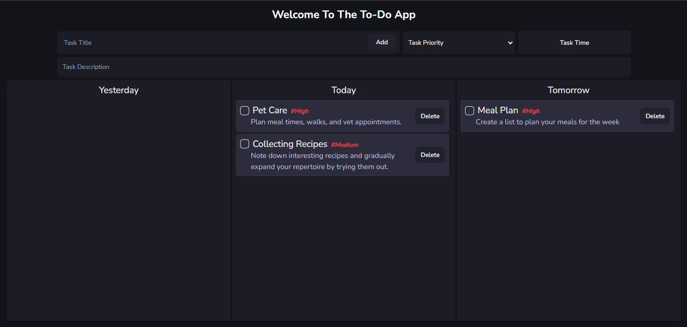

# 📕ITo-Do



# ITo-Do

ITo-Do is a todo application built using React, Tailwind CSS, and Redux.

## Purpose

ITo-Do allows users to easily list, edit, and track their tasks. The purpose of this project is to create a basic todo application and implement core functionalities using popular technologies such as React, Tailwind CSS, and Redux.

## Features

* Ability to add a new task.
* Ability to mark completed tasks.
* Ability to delete completed tasks.

## Technologies Used

* React: For building the user interface.
* Tailwind CSS: For quick and flexible styling.
* Redux: For managing application state.
* Redux Toolkit: To simplify and optimize Redux usage.
* React-Redux: For using Redux with React applications.

## Installation and Usage

1. Clone the project repository:

```bash
git clone https://github.com/ErsaGunTosun/IToDo
```

2. Navigate to the project directory:

```bash
cd IToDo
```

3. Install the required packages:

```bash
npm install
```

4. Start the application:

```bash
npm start
```

## Contact

If you have any questions or suggestions, feel free to reach out to us at [ersagun@ersaguntosun.com ](mailto:ersagun@ersaguntosun.com).
